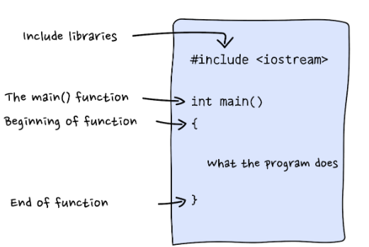

# Programming-in-Cpp

### Introduction
C++ is a programming language created by *__Bjarne Stroustrup__* and his team at Bell Laboratories in 1979. Forty years later, it is one of the most widely used languages in the world; we can find C++ applications everywhere, from the bottom of the oceans to the surface of Mars.

As the name implies, C++ was derived from the C language; Bjarne’s goal was to add object-oriented programming into C, a language well-respected for its portability and low-level functionality.

So why learn C++? Among many other things:
1. It is fast and flexible.
2. It is well-supported.
3. It forces you to think in new and creative ways.

C++, like most programming languages, runs line by line, from top to bottom. Here is the structure of a C++ program:

### Compile & Execute
C++ is a compiled language. That means that to get a C++ program to run, you must first translate it from a human-readable form to something a machine can “understand.” 
That translation is done by a program called a *__compiler__*.

When you program in C++, you mainly go through 4 phases during development:

1. Code — writing the program
2. Save — saving the program
3. Compile — compiling via the terminal
4. Execute — executing via the terminal

And repeat (debug the errors if needed)

### Variables
A variable is simply a name that represents a particular piece of your computer’s memory that has been set aside for you to store, retrieve, and use data.

C++’s basic data types:

1. __int__      : *integer numbers*
2. __double__   : *floating-point numbers*
3. __char__     : *individual characters*
4. __string__   : *sequence of characters*
5. __bool__     : *true/false values*

Every variable has a type, which represents the kind of information you can store inside of it. It tells your compiler how much memory to set aside for the variable and it defines exactly what you can do with the variable

#### Declare Variable :
Every variable in C++ must be declared before it can be used!
>> 
    C++ is known as a strongly typed language. If you try to give an integer value a decimal number, 
    you are going to get unexpected results, warnings, or errors.
>>

#### Initialize variable:
After we declare a variable, we can give it a value!
In C++, a single equal sign = does not really mean “equal”. It means “assign”.

#### Types of Errors:
1. *__Compile-time errors:__* Errors found by the compiler.
2. *__Link-time errors:__*    Errors found by the linker when it is trying to combine object files into an executable program.
3. *__Run-time errors:__*     Errors found by checks in a running program.
4. *__Logic errors:__*        Errors found by the programmer looking for the causes of erroneous results.

### Introduction to Vectors
A vector is a sequence of elements that you can access by index.

#### Creating a vector
The std::vector lives in the <vector> header. So first, we need to add this line of code at the top of the program:
>>
    include <vector>
>>

syntax :
>>
    std::vector<type> name;
>>

#### Initialisation of vector
>>
    std::vector<double> location = {42.651443, -73.749302};
>>

#### Index
Now that we have a vector, how do we access an individual element? This is where index comes into play.

An index refers to an element’s position within an ordered list. Vectors are 0-indexed, meaning the first element has index 0, the second index 1, and so on.

#### Adding and Removing Elements
Often, we start with a vector that’s either empty or a certain length. As we read or compute data we want, we can grow the vector as needed.

#### Adding Elements
*__.push_back()__*
>>
     
    To add a new element to the “back”, or end of the vector, we can use the .push_back() function.
    Syntax: 
    std::vector<std::string> name_of_vector = {"content1", "content2"};
>>

#### Removing Elements
*__.pop_back()__*
>>

    You can also remove elements from the “back” of the vector using .pop_back().
    Syntax:
    "vector_name".pop_back();
>>

#### Size of Vector
*__size()__*
>>
    <std::vector> not only stores the elements; it also stores the size of the vector:
    The .size() function returns the number of elements in the vector.
>>

### The Function of Functions